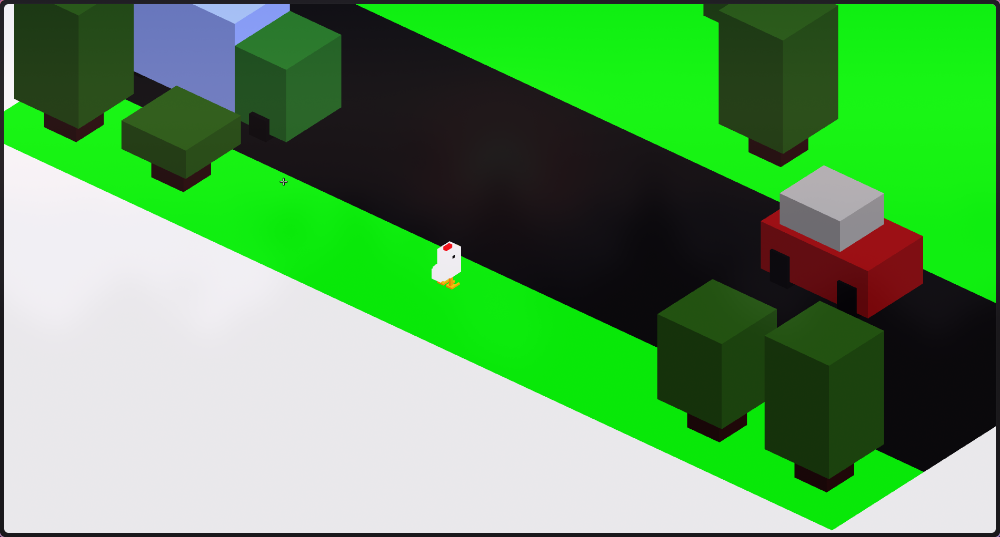
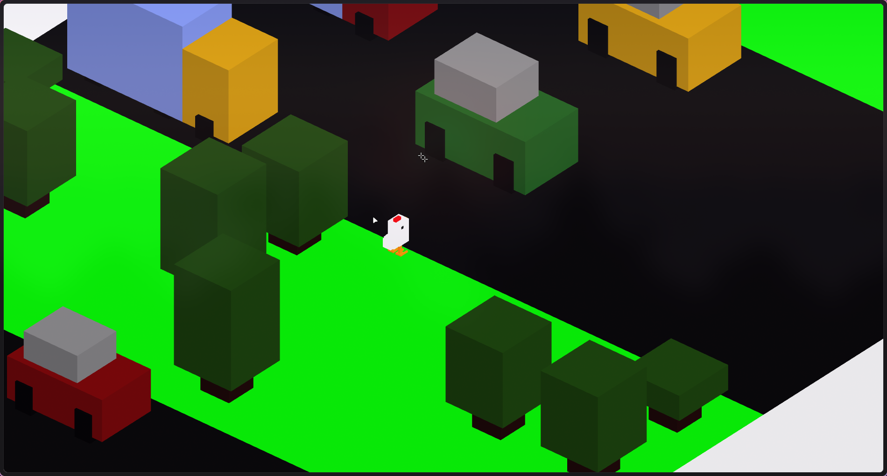
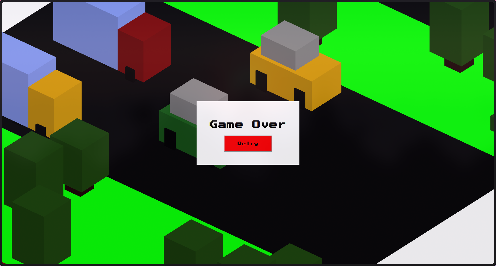

# 🐔 Crossy Road Clone (Three.js)

Este proyecto es una recreación en 3D del clásico juego *Crossy Road*, desarrollada con *Three.js* y *Blender*. El jugador controla a un personaje que debe avanzar por diferentes terrenos, evitando obstáculos como árboles y vehículos en movimiento.

## 🛠️ Instalación

1. **Clona el repositorio:**

   ```bash
   git clone https://github.com/tu-usuario/crossy-road-threejs.git
   cd crossy-road-threejs
````

2. **Instala las dependencias:**

   ```bash
   npm install
   ```

3. **Inicia el servidor de desarrollo:**

   ```bash
   npm run dev
   ```

4. **Abre el juego en tu navegador:**

   ```
   http://localhost:5173
   ```

## Controles

* `↑` Avanzar (forward)
* `↓` Retroceder (backward)
* `←` Izquierda (left)
* `→` Derecha (right)

## 🖼️ Capturas






